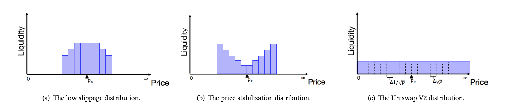

Concentrated Liquidity
=============================

   An example of iZiSwap pool status.

|br|

**Concentrated liquidity** is a mechanism that contrasts with UniswapV2(V2) liquidity. 

In the mechanism of V2, liquidity providers need to provide liquidity across the entire price range, which will result in low utilization of funds.
For example, in practical situations, it is almost impossible for someone to sell ETH at a price of 1ETH = 1 USDC. However, in the V2 mechanism, we still need to prepare a certain amount of USDC to deal with this situation.
As illustrated in the `figure2`_ (c), liquidity is evenly distributed throughout the entire space. 
It is worth noting that even distribution of liquidity does not mean an equal distribution of token quantity. For more detailed information about V2, please refer to Uniswap's official documentation.

Concentrated liquidity refers to the ability to place liquidity in a designated range according to management strategies. For example, placing liquidity in the range of 1 ETH = [1000, 5000] USDC as a counterparty.
Assuming that the current price of the pool is 1 ETH = 3000 USDC. In the range of [1000,3000], liquidity providers provide USDC as counterparties for traders selling ETH, while in the range of [3000,5000], liquidity providers provide ETH as counterparties for traders buying ETH.
If the price of PoolToken 1ETH < 1000 USDC, then the form of liquidity will be converted to a single token ETH; otherwise, if the price of PoolToken 1ETH > 5000 USDC, then the form of liquidity will be a single token USDC.

Range Liquidity
------------------------------------

Blockchain transactions have high requirements for time complexity. If liquidity is handled separately at each price point, polling will be introduced and the time complexity will be unacceptable.
Therefore, in the iZiSwap protocol, liquidity is managed in **Range**.  A range refers to a continuous set of price points, i.e., 

.. math::
    R_{l,r} = \{p_i | i \in [l, r)\}

And a **Range Liquidity** :math:`Lp(R_{l,r},L)` refers to a position that each price point within a given range has the same liquidity :math:`L`.

Recall the definition of Liquidity, :math:`L_i = x\sqrt{p_i} + y/\sqrt{p_i}, i \in (-\infty, \infty)`,
where :math:`L_i` represents the liquidity quantity on price point :math:`p_i`, :math:`x,y` are the quantities of tokenX and tokenY respectively.
Suppose the current price point  :math:`l < pc < r`, with a little abuse of :math:`pc` and the index :math:`c`, in the interval [l, pc), liquidity exists in the form of tokenY, while in the interval (pc, r), liquidity exists in the form of tokenX. At price point pc, liquidity exists in the form of both tokenX and tokenY.
Due to the equal liquidity at each price point and the fact that prices form a geometric sequence, the required amounts of tokenX and tokenY for adding liquidity can be obtained in O(1) time. For PC points, they can be added in any proportion.

*The concept of interval liquidity was first proposed by UniswapV3. Unlike our arithmetic sequence, their flow density is the same at each point, and their ingenious design can be calculated by integration in O(1) time.*

.. |br| raw:: html

       