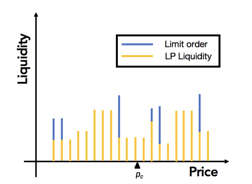
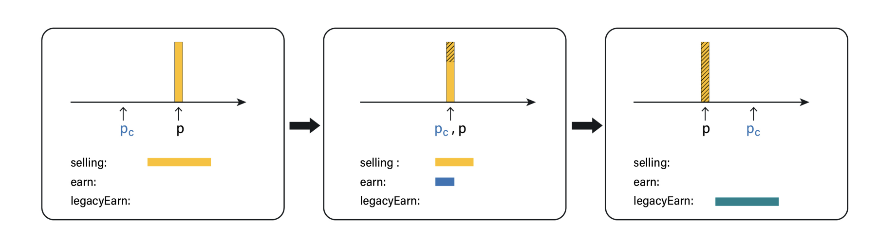

Limit Order
=============================

   Illustration of Liquidity conditioned combined with normal positions and limit orders.  

**Limit Order** refers to providing liquidity at a specified price point as a counterparty, and the transaction is executed when the price reaches the specified price point and a trader try to take a swap action. 
Unlike normal liquidity positions, the liquidity provided by limit orders is one-time only and will not be repeatedly traded. 

For example, for the ETH/USDC/0.2% pool, the current price is 1 ETH = 2000 USDC. 
A user placed a sell limit order of 1 ETH at a price of 2500 USDC. When the price reaches or crosses 2500, this limit order will be filled. 
However, if the price drops again to, for example, 2000 USDC, the token in this limit order still exists as 2500 USDC instead of 1 ETH.

From the perspective of swap, there is no difference in liquidity provided by both limit orders and normal liquidity positions. They are processed uniformly. 
However, from an implementation perspective, we need new algorithms because on-chain operations require low time and space complexity. In traditional CEX matching engines, 
the execution of limit orders requires traversal of order placers in chronological order. However, this is not acceptable on the blockchain. We propose the following two key designs for this purpose.

Grouped Limit Order
------------------------------------
Group the limit orders of different users at the same point into a grouped value, which is the single target object in the swap process. 
The status updates of different users are lazy, meaning that their own parts will only be processed from this grouped value when they update their own limit orders.

Legacy Design
------------------------------------

