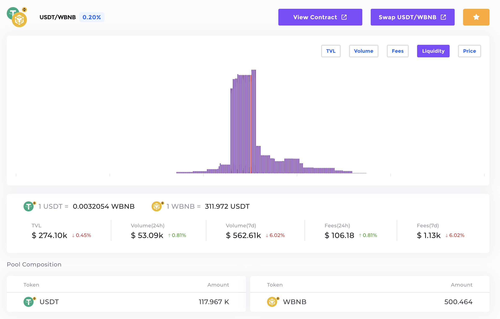

Pool 
=============================

   An example of iZiSwap pool status.

A **POOL** in iZiSwap is distinguished with tuple *<tokenA, tokenB, fee>*, e.g., *<BNB, USDT, 2000>* means the pool with token *ETH* and *USDT* with fee rate *0.2%*, where *fee* means the transaction fee a trader will pay if he initiate a swap action. *tokenA* and *tokenB* are tokens that must 
implement the ERC-20 standard.

A pool is similar to a trading market in CEX. For example, if you want to trade BNB and USDT on Binance, you go to 
the BNB-USDT spot market, while here you interact with the *<BNB,USDT,2000>* pools.  Liquidity are added into it and organized in a certain structure, with the help of the following design.

Point
-------------------------------------------

A **POINT** is a price point *p*, which means  *1 tokenA = p tokenB*. The price space is **discrete** in our design: 

.. math::
    p_i = p_0 \cdot ( 1+ d)^i, i \in (-\infty, \infty)

We choose :math:`d=0.0001, p_0 = 1` and :math:`i \in (-799999, +799999)` in our current implementation. We also call *Point* as *Tick* and make no distinction between these two terms.

*Price discretization is the starting point of our protocol's design and serves as the first perspective to describe DEX behavior. In contrast, UniswapV3's starting point is the function curve relationship between the reserves of two tokens, which then derives the concept of price. Therefore, in comparison, iZiSwap is clearer in defining prices by starting from the concept of price itself.*

Liquidity
-------------------------------------------

**LIQUIDITY**  can only be put on the discrete points above, and itself is a measurement of how many tokens are putted. The liquidity we define needs to satisfy symmetry, thereby eliminating logical differences between the two tokens and allowing for a time-efficient management solution. Taking all factors into consideration, the liquidity definition in iZiSwap is as follows:

.. math::
    L_i = x\sqrt{p_i} + y/\sqrt{p_i}, i \in (-\infty, \infty),

where :math:`L_i` represents the liquidity quantity on price point :math:`p_i`, :math:`x,y` are the quantities of tokenX and tokenY respectively.

As illustrated in the `figure`_, the height of the purple bars represents the amount of liquidity at different price points. It is important to note that for liquidity at different price points, even if their sizes are the same, the number of tokens they contain is not the same because :math:`p_i` is different. However, the difference between them is minimal at adjacent :math:`p_i` points.

Pool Status
-------------------------------------------

