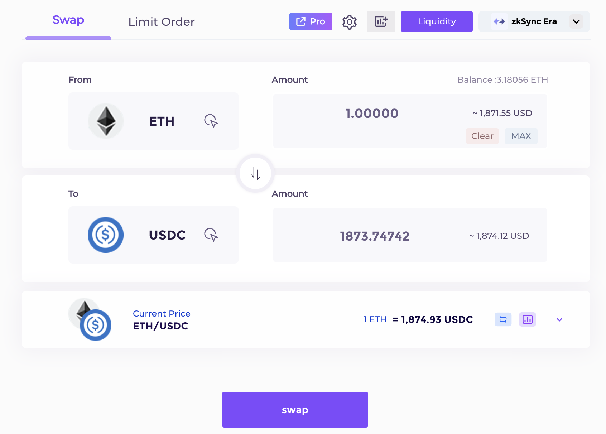

Swap
=============================

**Swap** is the process of exchanging a certain amount of tokenX for a certain amount of tokenY. 
From the current price point, swaps will consume the liquidity of the other token depending on the direction of exchange. This liquidity includes that provided by limit orders and normal liquidity positions.
When the liquidity at a price point is exhausted, the procedure continues to consume the liquidity at the next price point until all the liquidity at each price point is depleted or the specified quantity of tokens has been exchanged.

Constant Sum Rule
----------------------------------
