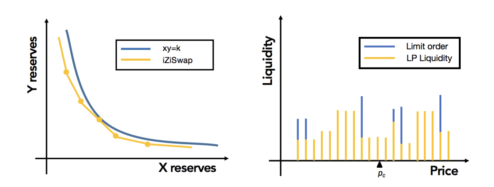

Overview
============

|br| **iZiSwap** is a novel, next-generation, highly-capital efficient Automated Market Maker (AMM) protocol. As illustrated in the above figure, 
the highlighted innovative features of **iZiSwap** include:

:`Discretized Price Space & Liquidity`: The price space is discretized into a series of points, and liquidity is only provided at these points. The design of discrete price points is more in line with people's perception of prices in reality and provides convenience for the introduction of limit orders.
:`Concentrated Liquidity & Constant Sum Rule`: By introducing a new liquidity definition, :math:`L := x\sqrt{p} + y/\sqrt{p}`,  and the **Constant Sum Rule**, :math:`x + y = k`, it is possible to deploy liquidity for any range in O(1) time and achieve **zero-slippage** trading.
:`Fully Non-custodial Limit Order Support`: Through innovative architecture design, the limit order is treated as a one-time liquidity provider and seamlessly integrated into the liquidity distribution. Through innovative algorithm design, limit orders are **completely non-custodial**, avoiding the fund risks brought by centralization, and can be completed in O(1) time, avoiding the time-consuming iterative method of traditional matching engines.
:`Flexible Liquidity Mining Solution`: Multiple flexible liquidity mining solutions are provided, including FixRange, OneSide, and DynamicRange, to avoid the negative impact on the system caused by only subsidizing current active liquidity.

Check more in the whitepaper: `iZiSwap: Building Decentralized Exchange with Discretized Concentrated Liquidity and Limit Order <https://assets.izumi.finance/paper/dswap.pdf>`_

*Special acknowledgement: We thank pioneer UniswapV3, the first protocol to propose a centralized liquidity AMM solution. We learned a lot of neat technical solutions from it.*

.. |br| raw:: html

       